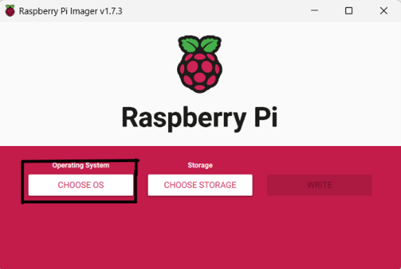
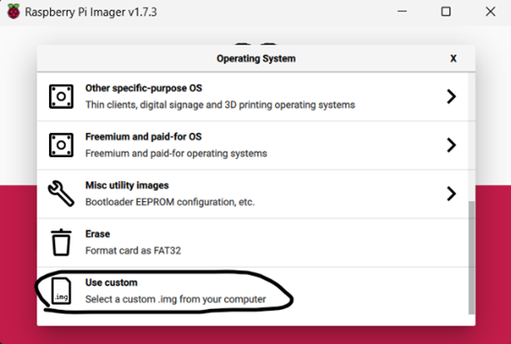
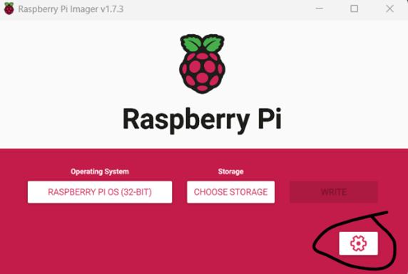
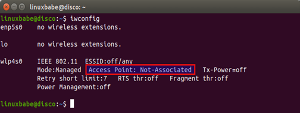

## Installing Ubuntu:
### Requirments:

1)	Raspberry pi 4
2)	SD card (minimum: 16)
3)	Mini HDMI to HDMI cable
4)	A monitor with HDMI port (better if it’s a new monitor as some old ones doesn’t work with rasbperry)
5)	Ethernet cable
6)	USB cable type C
7)	Keyboard

## To install Ubuntu (20.04.5) Focal Fossa:
##### You might wonder why focal fossa version; the answer is as it’s the only version that supports ROS noetic click the link to download.
After downloading the image, you will burn it on an SD card using raspberry pi imager , download from here: https://downloads.raspberrypi.org/imager/imager_latest.exe





Put the SD card in the raspberry pi and connect it to your laptop using the type C USB cable and connect it to your router using the ethernet and connect the keyboard to it.
Then wait for the Ubuntu to boot, this process takes from 5-7 minutes.

# Problems you will/might face after installing Ubuntu:
1)	Ethernet and Wi-Fi not configured.
2)	Source list is not correct.
3)	Ros noetic installation fails due to key failure

# Ethernet and Wi-Fi fix:
### Ethernet Fix:
-	```sudo dhclient -v```

You need to write this command every time you reboot your raspberry pi, and this is exactly why we use crontabs to get this job done.
-	```sudo crontab -e```

add this line anywhere in the crontab:

```@reboot echo "your user password" | sudo -S dhclient -v```

#### Then install net-tools package to debug and configure your network connection in the future:
-	```sudo apt install net-tools```
-	```sudo apt install wireless-tools```

### Wi-Fi Fix:
- ```	iwconfig ```



Take what will be written in the place of **wlp4s0**, most probably it will be **wlan0**
#### Then do the following commands:
-	```sudo ifconfig wlan0 up```
-	```sudo iwlist wlan0 scan | grep ESSID```
#### Find your SSID then:
-	```sudo apt install wpasupplicant```
-	```wpa_passphrase <your-ESSID> <your-wifi-passphrase> | sudo tee /etc/wpa_supplicant.conf```

#### To check the connection:
-	```sudo wpa_supplicant -c /etc/wpa_supplicant.conf -i wlan0```

## To set static IP:
- ```sudo nano /etc/dhcpcd.conf ```
```
interface eth0
static ip_address=192.168.0.4/24 #the static ip
static routers=192.168.0.1
static domain_name_servers=192.168.0.1
```
## Then you can connect through SSH with the raspberry 
1)	Use any IP scanner or go to your router home page to get you raspberry IP address or do ~$ifconfig 
2)	Download putty or use windows power shell on your laptop and connect to the raspberry pi IP address.

### To connect from Windows PowerShell:

- ```ssh <user on ubuntu>@<ip of the raspberry>```

# Source list is not correct fix:
Put the correct source links in(/etc/apt/source.list) by doing:
- ```sudo nano /etc/apt/source.list```

Then paste the source list down below.
```
deb http://ports.ubuntu.com/ubuntu-ports focal main restricted universe multiverse

deb-src http://ports.ubuntu.com/ubuntu-ports focal main restricted universe multiverse

deb http://ports.ubuntu.com/ubuntu-ports focal-updates main restricted universe multiverse

deb-src http://ports.ubuntu.com/ubuntu-ports focal-updates main restricted universe multiverse

deb http://ports.ubuntu.com/ubuntu-ports focal-backports main restricted universe multiverse

deb-src http://ports.ubuntu.com/ubuntu-ports focal-backports main restricted universe multiverse

deb http://ports.ubuntu.com/ubuntu-ports focal-security main restricted universe multiverse

deb-src http://ports.ubuntu.com/ubuntu-ports focal-security main restricted universe multiverse

deb http://archive.canonical.com/ubuntu focal partner

deb-src http://archive.canonical.com/ubuntu focal partner
```
Then do:
- ``` sudo update ```
- ``` sudo upgrade ```

# ROS noetic installation fails due to key failure:

Just follow the comamnds:
-	```sudo echo "deb http://packages.ros.org/ros/ubuntu focal main" | sudo tee /etc/apt/sources.list.d/ros-focal.list```
-	```sudo apt-key adv --keyserver 'hkp://keyserver.ubuntu.com:80' --recv-key C1CF6E31E6BADE8868B172B4F42ED6FBAB17C654```
-	```sudo apt update```
-	```sudo apt upgrade```
-	```sudo apt install -y python3-rosdep python3-rosinstall-generator python3-wstool python3-rosinstall build-essential cmake```
-	```sudo apt install python3-catkin python3-catkin-lint python3-catkin-pkg python3-catkin-pkg-modules python3-catkin-tools```
-	```sudo apt update```
-	```sudo apt upgrade```
-	```sudo apt install curl```
-	```curl -sSL 'http://keyserver.ubuntu.com/pks/lookup?op=get&search=0xC1CF6E31E6BADE8868B172B4F42ED6FBAB17C654' | sudo apt-key add -```
-	```sudo apt install ros-noetic-desktop```
